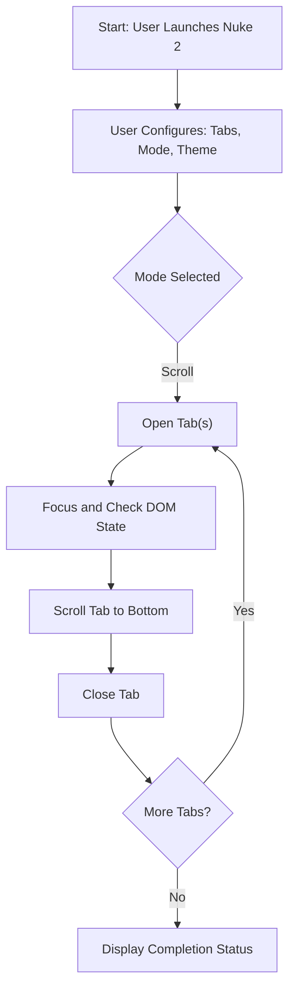
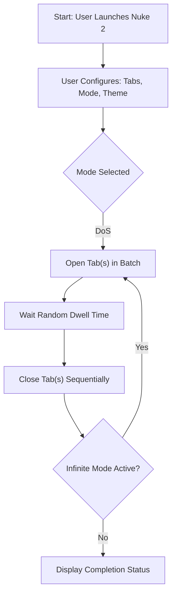

# Nuke 2

A High-Performance Bulk Tab Automation & Stress Testing Bookmarklet

---

## Introduction

Nuke 2 is a browser automation utility designed for high-throughput tab/window simulation and load testing. Featuring **Automated Scroll Simulation** and **Distributed Denial-of-Service (DoS) Simulation** modes, the tool offers a polished, persistent UI with live metrics panel, action controls, and a floating log window. All interactions are powered by modern standards and ergonomic design.

Strictly intended for legitimate testing, research, and engineering workflows.

---

## Features

- **Scroll Simulation Mode:**  
  Opens many tabs, scrolls each to the bottom, then closes them (for analytics, page view, or interaction testing).
- **DoS Simulation Mode:**  
  Generates bulk tab/window openings for resource impact or stress analysis.
- **Infinite Execution:**  
  Optionally loops tab automation for sustained workloads.
- **Apple-like UI/UX:**  
  - Persistent side panel, dark/light themes
  - Card-based live stats
  - Large buttons, modern design
  - Floating log window with action controls and batch progress

---

## Mermaid Diagrams

### Scroll Simulation Flow

### DoS Simulation Flow

---

## Usage

1. **Install as Bookmarklet:**  
   - Copy the minified script to a new browser bookmark.
   - Allow pop-ups for the site to fully enable tab automation.

2. **Activate:**  
   - Navigate to any target page and click the “Nuke 2” bookmarklet.
   - Configure via the side panel:  
      - Tab Count (1–999),
      - Mode: Scroll Simulation or DoS Simulation,
      - Theme: Dark/Light
   - Press **Launch**.

3. **Monitor & Control:**  
   - View live statistics in the sidebar.
   - Open the floating log window for session events and actions:
     - Pause, Resume, Stop, Clear Logs, Exit.

4. **Terminate:**  
   - Use log window controls, all tabs are closed on stop/completion.

---

## Requirements

- Modern Chromium-based browser (Chrome, Edge, Opera).
- Pop-up permissions enabled.
- ES6+ JavaScript support required.
- Same-origin policies enforced by browser security.

---

## Limitations

- **Cross-origin restrictions:**  
  Tab interactions and scroll automation may not function for other domains due to browser security.
- **System resource intensity:**  
  Bulk tab automation can be RAM and CPU intensive. The tool closes tabs for stability on completion.
- **Intended use:**  
  For QA, engineering, and authorized testing only.

---

## Credits

- Author: g-h-0-S-t (GitHub)
- Based on: [Nuke](https://github.com/g-h-0-S-t/Nuke), [openTabsAndScroll](https://github.com/g-h-0-S-t/openTabsAndScroll), [Content Moderation Assistant](https://github.com/g-h-0-S-t/Content-Moderation-Assistant)
- License: MIT

---

## Disclaimer

Nuke 2 is provided exclusively for authorized, law-abiding research, testing, and automation. ***Misuse or illegal deployment is strictly prohibited and not the responsibility of the author.***

---
